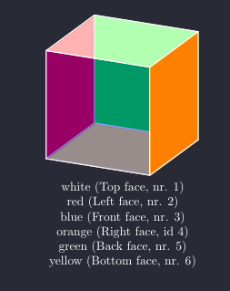

# RCS

### Rubik’s Cube Solver (Old Pochmann)

----------

## Description

This repository contains multiple implementations of a Rubik’s Cube solver. The solver is based on the Old Pochmann method.

>> The Old Pochmann Method, which is a method that solves one piece at a time, is a method typically used by beginner blindsolvers.
>> Blindfolded solvers use letter patterns to help memorize sequences of moves in order to solve the cube.
> 
> https://en.wikipedia.org/wiki/Speedcubing Blindfolded methods

----------

### Implementations

- [x] [Python3](./py/)
- [x] [C++](./cpp/)
- [ ] [Haskell](./rcs-hs/)  <!-- stack new rcs-hs --resolver ghc-9.2.8 -p 'category: "Rubik’s Cube Solver"' -->
- [ ] [Rust](./rcs-rs/)     <!-- cargo new rcs-rs -->
- [ ] [Emacs lisp](./el)
- [ ] OCaml
- [ ] maybe APL
- [ ] maybe Shell

<!-- no i will not add a java implementation!!! -->

----------

## Move notation 

>> Many 3×3×3 Rubik's Cube enthusiasts use a notation developed by David Singmaster
>> to denote a sequence of moves, referred to as "Singmaster notation". Its relative
>> nature allows algorithms to be written in such a way that they can be applied
>> regardless of which side is designated the top or how the colours are organised
>> on a particular cube.
>>
>> - F (Front): the side currently facing the solver
>> - B (Back): the side opposite the front
>> - U (Up): the side above or on top of the front side
>> - D (Down): the side opposite the top, underneath the Cube
>> - L (Left): the side directly to the left of the front
>> - R (Right): the side directly to the right of the front
>> - ...
>>
>> When a prime symbol ( ' ) follows a letter, it denotes an anticlockwise face turn;
>> while a letter without a prime symbol denotes a clockwise turn. These directions
>> are as one is looking at the specified face. A letter followed by a 2 
>> (occasionally a superscript 2) denotes two turns, or a 180-degree turn. R is right
>> side clockwise, but R' is right side anticlockwise. ...
>
> https://en.wikipedia.org/wiki/Rubik%27s_Cube Singmaster notation
>
> http://www.sporenberg-marl.de/Rubik_Cube_Notation.html `Die Notation des Rubiks Cube` with nice graphics

<!--
\documentclass{minimal}
\usepackage{tikz,tikz-3dplot}

\usepackage{xcolor}
\pagecolor[RGB]{40,42,54}
\color{white}

\begin{document}
  \tdplotsetmaincoords{70}{115}
\begin{figure}
\centering
  \begin{tikzpicture}[scale=4,tdplot_main_coords]
    \coordinate (O) at (0,0,0);
    \tdplotsetcoord{P}{1.414213}{54.68636}{45}
    
    \draw[fill=green,fill opacity=1] (O) -- (Py) -- (Pyz) -- (Pz) -- cycle;
    \draw[fill=yellow,fill opacity=1] (O) -- (Px) -- (Pxy) -- (Py) -- cycle;
    \draw[fill=red,fill opacity=1] (O) -- (Px) -- (Pxz) -- (Pz) -- cycle;
    \draw[fill=white,fill opacity=0.7] (Pz) -- (Pyz) -- (P) -- (Pxz) -- cycle;
    \draw[fill=blue,fill opacity=0.4] (Px) -- (Pxy) -- (P) -- (Pxz) -- cycle;
    \draw[fill=orange,fill opacity=1] (Py) -- (Pxy) -- (P) -- (Pyz) -- cycle;

  \end{tikzpicture}
\caption{
\\white (Top face, nr. 1)\\
red (Left face, nr. 2)\\
blue (Front face, nr. 3)\\
orange (Right face, id 4)\\
green (Back face, nr. 5)\\
yellow (Bottom face, nr. 6)\\
} \label{fig:M1}
\end{figure}

\end{document}
-->

----------

<!--

### Stats

gitstats . gitstats-out

cloc . > repo-cloc.txt

tree . > repo-tree.txt

-->
